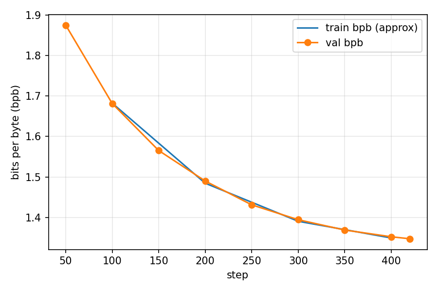
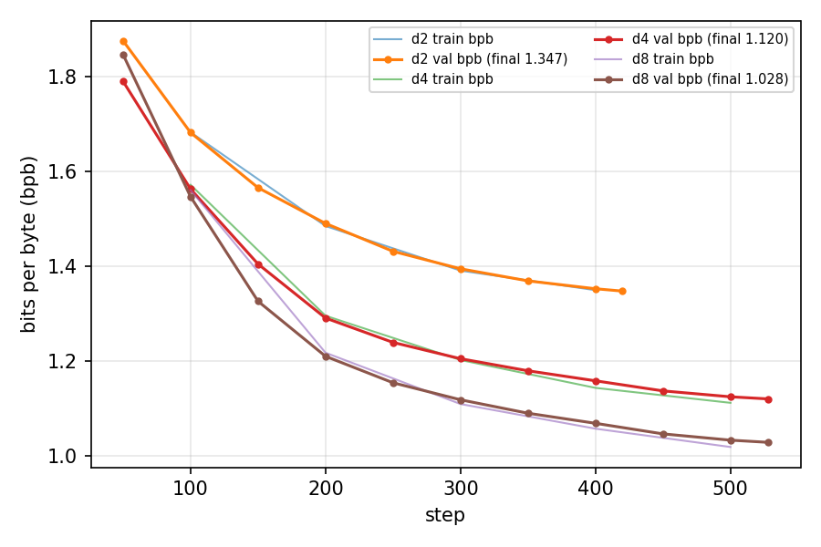

# Assignment: commands, run logs, and results

Commands run for each task. Effective hyper-parameters match the `user_config`
written into each checkpoint's `meta_*.json` (see [`checkpoints/`](checkpoints/)).
Run logs are in [`runs/`](runs/).

## Task 0 - Model Hub warm-up

Report section: `\S5.4` of the assignment. For each model we recorded training
tokens/steps, architecture (layers, hidden dim, heads, params), and training
data, noting the source for every field:

| Field | OLMo-1B | SmolLM2-360M | Qwen2.5-0.5B | Source |
|---|---|---|---|---|
| Training tokens | ~2 T (paper) / 3 T (card) | 4 T | up to 18 T (series) | paper / model card |
| Layers | 16 | 32 | 24 | `config.json` |
| Hidden dim | 2048 | 960 | 896 | `config.json` |
| Attention heads | 16 (MHA) | 15 (GQA, 5 KV) | 14 (GQA, 2 KV) | `config.json` |
| Params | ~1.2 B | 0.4 B | 0.49 B | paper / `config.json` |
| Context | 2048 | 8192 | 32768 | `config.json` |
| Vocab | 50280 | 49152 | 151936 | `config.json` |
| Data | Dolma | FineWeb-Edu, DCLM, The Stack mix | web + math/code + synthetic | paper / model card |

All three are decoder-only causal transformers. Notes recorded in the report:
- OLMo-1B: architecture from `config.json`; the paper reports 2 T tokens while
  the model card later claims 3 T - a discrepancy worth noting.
- SmolLM2-360M: Llama-style `config.json`; 4 T token count and data mix from paper.
- Qwen2.5-0.5B: `config.json` shows 24 layers, GQA 14 Q/2 KV heads, large
  151,936 vocab; 18 T is the series maximum, not per-model.

## Task 1 - Tokenization (`vocab` 8,192 and 32,768)
`runs/tokenizer.sh` runs the whole flow for Task 1 for both vocab sizes. This scripts runs the following commands:

```bash
python -m scripts.tok_train --vocab-size 8192        # then 32768
cp -r ~/.cache/nanochat/tokenizer ~/.cache/nanochat/tokenizer_8192
python -m scripts.tok_eval                           # compression comparison
python -m scripts.tok_artifacts --text "1,586,291 people live in country 224393."
python -m scripts.tok_artifacts --text $'def hello_world():\n    print(\'Hello, world!\')\nhello_world()'
python -m scripts.tok_artifacts --text "Hola, ¿cómo estás?"
python -m scripts.tok_artifacts --text "정직한 사실 위에, 공정한 시선을 더하다"
```

- `scripts/tok_eval.py`: compares our tokenizer's compression (bytes/tokens
  ratio, plus the added `tok_per_char` metric) against GPT-2 and GPT-4 (cl100k)
  tokenizers on fixed news / Korean / code / math / science / CLIMBMix-train/val
  snippets.
- `scripts/tok_artifacts.py`: tokenizes a given text and prints each token's
  id + decoded fragment, used to inspect failure cases for numbers, source code,
  and non-English text.

## Task 2 - Pretraining (`depth 2`, comparison at depth 4 and 8)

```bash
.venv/bin/python -m scripts.base_train --run dummy --depth 2 \
    --max-seq-len 2048 --window-pattern L --device-batch-size 16 \
    --eval-every 50 --eval-tokens 524288 --save-every 250
# comparison runs, same flags at --depth 4 and --depth 8
.venv/bin/python -m scripts.base_train --run dummy --depth 4 \
    --max-seq-len 2048 --window-pattern L --device-batch-size 16 \
    --eval-every 50 --eval-tokens 524288 --save-every 250
.venv/bin/python -m scripts.base_train --run dummy --depth 8 \
    --max-seq-len 2048 --window-pattern L --device-batch-size 8 \
    --eval-every 50 --eval-tokens 524288 --save-every 250
```

Logs: `runs/task2_d2.log`, `runs/task2_d4{,,_eval}.log`, `runs/task2_d8{,,_eval}.log`.
Final checkpoint: `checkpoints/d2/model_000420.pt` (`meta_000420.json`).

Validation bits-per-byte curves across the depth-2 run:



Depth-2 vs depth-4/8 comparison:



## Task 3 - Chat fine-tuning (Stage 1 mid-training, Stage 2 SFT)

```bash
# Stage 1: mid-training (MMLU + GSM8K) on top of the d2 base checkpoint
.venv/bin/python -m scripts.chat_sft --run task3_d2_mid --model-tag d2 \
    --model-step 420 --stage mid --source base --save-tag d2_mid
# Stage 2: SFT (SmolTalk) on top of the stage 1 checkpoint
.venv/bin/python -m scripts.chat_sft --run task3_d2_sft --model-tag d2_mid \
    --model-step 928 --stage sft --source sft --save-tag d2_sft
# held-out ARC / GSM-8K evaluation at each stage
.venv/bin/python -m scripts.chat_eval -i base  -g d2     -s 420   # base
.venv/bin/python -m scripts.chat_eval -i sft   -g d2_mid -s 928   # mid
.venv/bin/python -m scripts.chat_eval -i sft   -g d2_sft -s 2868  # sft
```

`scripts/chat_sft.py` persists the resolved hyper-parameters (max seq len, device
and total batch sizes, learning rates) into each checkpoint's meta and
`user_config`, so a later stage inherits exactly what the earlier stage used.

Logs: `runs/task3_*.log`. Checkpoints: `checkpoints/d2_mid/`, `checkpoints/d2_sft/`.

## Task 4 - Temperature study and inference

```bash
# interactive chat against the final d2_sft checkpoint at different temperatures
.venv/bin/python scripts/chat_cli.py -i sft -g d2_sft -s 2868 -t 0.1
.venv/bin/python scripts/chat_cli.py -i sft -g d2_sft -s 2868 -t 0.7
.venv/bin/python scripts/chat_cli.py -i sft -g d2_sft -s 2868 -t 1.5
```

Logs: `runs/task4temp/*.log`.
